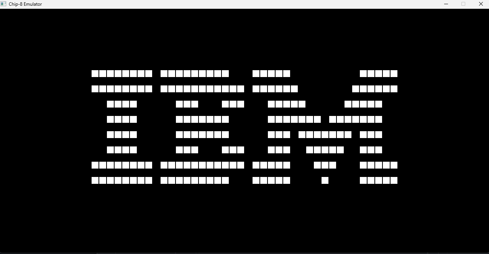
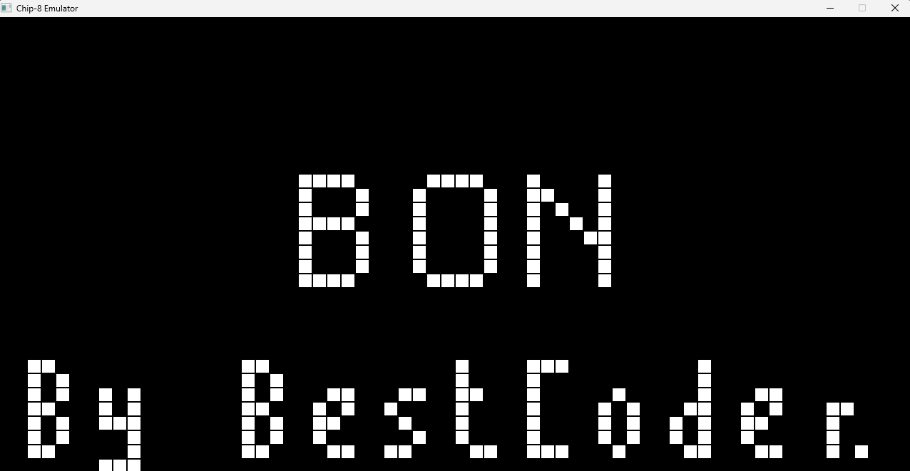
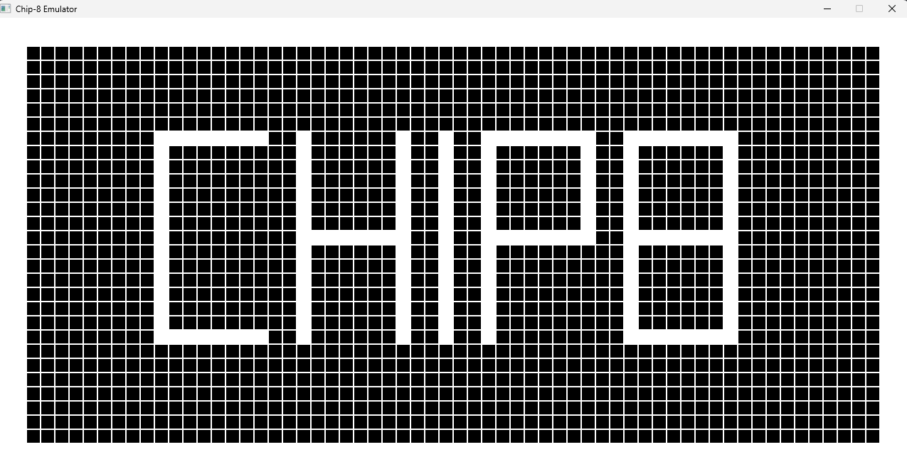
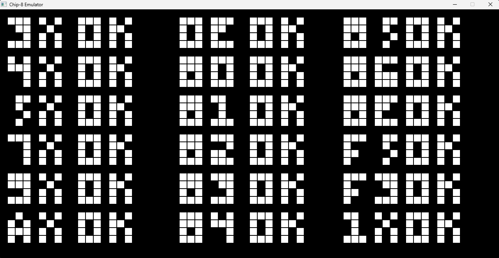
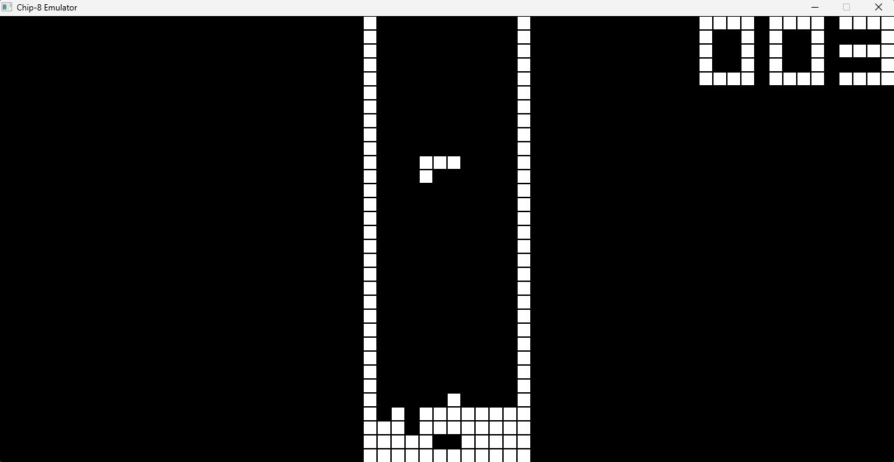
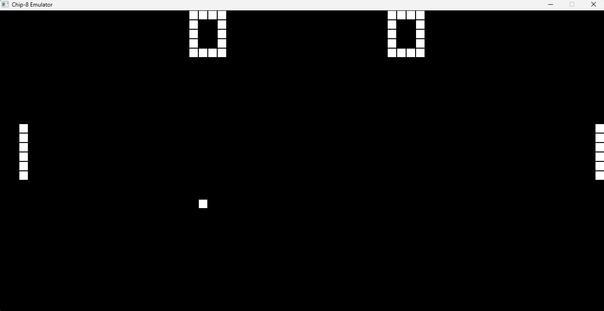

# Chip-8_Emulator
Chip-8 Emulator with C++ and SDL2 to understand software and emulator architecture

## Controls
| Chip-8  | Keyboard |
| ------------- | ------------- |
| <kbd> 1 2 3 C </kbd>  | <kbd> 1 2 3 4 </kbd>  |
| <kbd> 4 5 6 D </kbd>  | <kbd> Q W E R </kbd>  |
| <kbd> 7 8 9 E </kbd>  | <kbd> A S D F </kbd>  |
| <kbd> A 0 B F </kbd>  | <kbd> Z X C V </kbd>  |

## Screenshots
|                          |                          |
:-------------------------:|:-------------------------:
| IBM LOGO                 | BC TEST                  |
|  |  | 
| CHIP-8 LOGO              | TEST OPCODE              |
|  |  |
| TETRIS                   | PONG                     |
|  |  |

## Resources
* https://tobiasvl.github.io/blog/write-a-chip-8-emulator/
* https://en.wikipedia.org/wiki/CHIP-8
